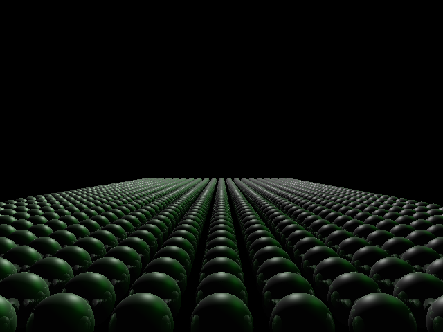

# CSE 167 – Computer Graphics Projects
### Rendered Results




This repository contains my projects and assignments for **CSE 167: Computer Graphics**.  
The course focuses on the fundamentals of 3D computer graphics, including geometric transformations, rendering pipelines, lighting models, and OpenGL programming.

---

## Overview
CSE 167 provides hands-on experience in building a basic 3D graphics engine from the ground up.  
Topics covered:
- 3D transformations and viewing (model, view, projection matrices)  
- Camera manipulation and coordinate systems  
- Lighting and shading (Phong illumination, reflection models)  
- Texture mapping and materials  
- Hierarchical modeling and animation  
- Mesh loading and rendering  
- Introduction to modern OpenGL and shader programming (GLSL)

---

---

## Tools & Technologies
- **Language:** C++  
- **Graphics API:** OpenGL / GLSL  
- **Libraries:** GLFW, GLEW, GLM, Assimp, stb_image  
- **IDE / Build:** Visual Studio Code, Make, CMake  
- **Platform:** macOS / Linux  

---

## Concepts Demonstrated
- Implementation of the full 3D rendering pipeline  
- Construction and manipulation of transformation matrices  
- Lighting and shading computations in shader code  
- Texture mapping and model loading from OBJ files  
- Real-time camera control and scene navigation  
- Interactive rendering and animation  

---

## How to Run
1. Install dependencies (GLFW, GLEW, GLM, Assimp).  
2. Build and run:
   ```bash
   mkdir build && cd build
   cmake ..
   make
   ./CSE167_Project
3.	Use keyboard/mouse controls to navigate the 3D scene.

---

## Results
	•	Developed a real-time 3D rendering pipeline in C++ and OpenGL.
	•	Implemented lighting, texture, and animation features from scratch.
	•	Rendered multiple interactive 3D objects with accurate transformations.
	•	Gained practical understanding of computer graphics and GPU programming.

## Acknowledgment

All implementations are original and intended for educational and portfolio demonstration purposes. Do not copy for malicious intent. 
 
## More info
1. Averi (Zhizhen) Yu (Solo)  
2. zhy008@ucsd.edu  
3. https://raviucsdgroup.s3.amazonaws.com/hw3/ddd469811ebeec63098ebcfbc8551031/20230322061442/index.html  
4. Operating System: Mac OS  
5. https://docs.google.com/document/d/1dijGuPjZuvdwUIkys5lnUUC9U5bo123cSlVEnL5FQog/edit?usp=sharing  

